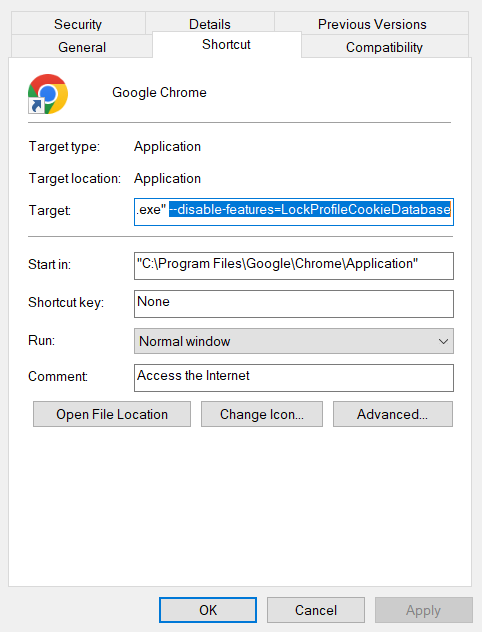

# "weibo.com" Web Crawler

 The toolbox to collect posts from https://weibo.com


## FAQ

**Q: Can I use it in Linux?**

A: Partially. You should get cookies with Google Chrome in Windows. After finishing step 5, you can copy this database to Linux machine and retrieve posts before the cookies expire.

**Q: Can I get cookies in Linux?**

A: Yes. You can paste cookies manually and there are two ways to pass it to the program. First, assign it to the variable `cookies` in Line 136 (source code version 0.4.1) of `search.py`. Second, parse it into keys and values, and make up an expire time. Then insert it into `cookies` table of this program's database (in default `posts.db`).

**Q: Can I skip step 2?**

A: Partially. You can skip if using Google Chrome 113 or below.

**Q: Why the searching result is empty, excluding the program failures?**

A: First, searching non-Chinese string will usually return nothing, because "weibo" is a Chinese social media. Second, there are several hours' delay before posts appear in the searching engine. It's better to search posts 2 days ago.

## Usage

1. Run the following command.
   ```bash
   pip install -r requirements.txt
   ```

2. Copy Google Chrome shortcut, and add a blank then `--disable-features=LockProfileCookieDatabase` after its `target` value.
   

3. Use this shortcut to open Google Chrome. Login https://weibo.com/ and don't close it.

5. Open the command line, activate Python environment, and use `dir` to navigate to the program's root directory. Run the following command.
   ```
   python main.py --login
   ```

6. Close Google Chrome.

7. For example, you want to search posts containing "Genshin Impact" on August 15, 2023 from 11:00-12:00. You retrieve at most 2 pages (20 posts). Run the following command.

   ```
   python main.py --query="Genshin Impact" --start_time=2023-08-15-11 --end_time=2023-08-15-12 --max_page=2
   ```

8. Open `posts.db` in the program's root directory. View `search` table, whose data structure is as follows.

   | Name       | Type | Description                                                  |
   | ---------- | ---- | ------------------------------------------------------------ |
   | query      | text | The searching words.                                         |
   | start_time | text | Posts from this hour will be collected. The [format code](https://docs.python.org/3/library/datetime.html#strftime-and-strptime-format-codes) is %Y-%m-%d-%H |
   | end_time   | text | Posts till this hour will be collected. The format is the same as `start_time` |
   | table      | text | The table name that this query's results are stored.         |
   
8. According to this table name, view the results in the mentioned table.


For more usages, run the following command.

```
python main.py --help
```


The data structure of searching results are as follows.

| Name        | Type | Description                                                  |
| ----------- | ---- | ------------------------------------------------------------ |
| avatar      | text | Link to the avatar of the post author.                       |
| nickname    | text | Username of the post author.                                 |
| user_id     | text | User ID of the post author. Their profile is at https://weibo.com/u/user_id where `user_id` should be replaced with the value from this column. |
| posted_time | text | The time when the post published. Its format can be either seconds/hours/days ago (in Chinese) or an exact datetime with or without years. |
| source      | text | How the post author visit "weibo". It can be either the device name or the topic (tag) name. |
| weibo_id    | text | The post can be accessed at https://weibo.com/user_id/weibo_id where `user_id` and `weibo_id` should be replaced with values from the columns. |
| content     | text | The main body of the post. This column of fast reposts will be empty. |
| reposts     | text | Number of reposts. If the number exceeds 10 thousands, it will be ended with the Chinese character "万". The character "万" is a unit, which means 10 thousands. Similar in `comments` and `likes`. |
| comments    | text | Number of comments.                                          |
| likes       | text | Number of likes.                                             |

